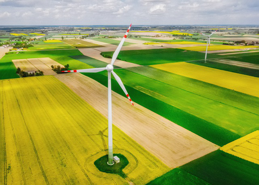

## مثال

|  صورة المدخلات | صورة القناع | صورة النتيجة |
|----------------|-------------|--------------|
| ||

## خطوات تشغيل الكود

### 1. **تحميل مستودع GitHub**

قم باستنساخ مستودع `deepfillv2-pytorch`:

```bash
!git clone https://github.com/nipponjo/deepfillv2-pytorch.git
%cd /kaggle/working/deepfillv2-pytorch
```

### 2. **تحميل أوزان النموذج**

لتتمكن من استخدام النموذج المدرب مسبقًا لملء المناطق المحددة، قم بتحميل الأوزان الخاصة بالنموذج من الرابط التالي:

[تحميل أوزان النموذج من Google Drive](https://drive.google.com/file/d/1y2T4FwGPPN87y-blDAvOwqsK66O_SEYE/view?usp=sharing)

بعد التحميل، قم برفع ملف الأوزان إلى بيئة العمل الخاصة بك (مثل Kaggle أو Google Colab)، وحدد المسار لاستخدامه في الخطوة الخامسة.

### 3. **إنشاء قناع الصورة**

قم بتشغيل السكربت `create_mask.py` لإنشاء قناع أبيض يشير إلى المناطق التي سيتم تعبئتها في الصورة.

```bash
python create_mask.py /path/to/image.png /path/to/output/white_mask.png
```

### 4. **تغيير حجم الصورة والقناع**

قم بتشغيل السكربت `resize_images.py` لتغيير حجم كل من الصورة المدخلة والقناع بحيث تتوافق مع أبعاد النموذج.

```bash
python resize_images.py /path/to/image.png /path/to/resized_image.png
python resize_images.py /path/to/white_mask.png /path/to/resized_white_mask.png
```

### 5. **تشغيل النموذج**

قم بتشغيل السكربت `run_model.py` لتطبيق النموذج على الصورة المدخلة والقناع بعد تغيير حجمهما.

```bash
python run_model.py /path/to/resized_image.png /path/to/resized_white_mask.png /path/to/output_image.png /path/to/checkpoint.pth
```

> **ملاحظة**: تأكد من تحديد المسار الصحيح لملف الأوزان (`checkpoint.pth`) بعد تحميله.

### 6. **عرض الصورة الناتجة**

قم بتشغيل السكربت `display_output.py` لتغيير حجم الصورة الناتجة إلى الأبعاد الأصلية وعرضها.

```bash
python display_output.py /path/to/output_image.png /path/to/image.png
```

### ملاحظات إضافية

- تأكد من ضبط جميع المسارات بشكل صحيح حسب بيئة العمل التي تستخدمها.
- يمكنك تعديل أبعاد `resize` لتتناسب مع متطلبات النموذج إذا لزم الأمر.
- هذا الكود يفترض توفر معالج رسوميات (GPU) في بيئة العمل الخاصة بك لتسريع تنفيذ النموذج.

