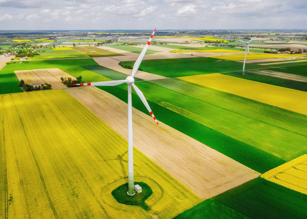
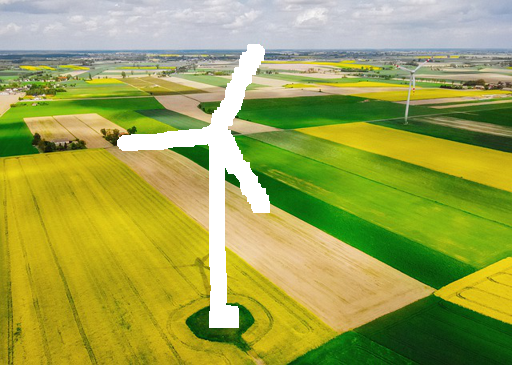
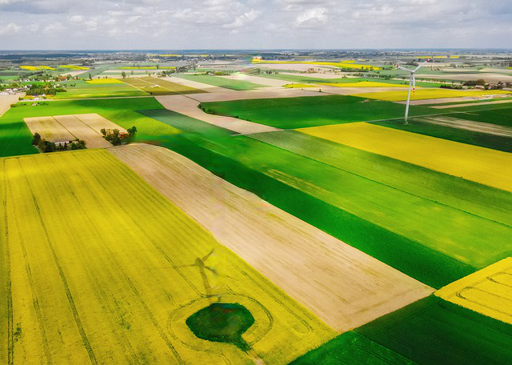

## Example

|  Input Image | Masked Image | Output Image|
|--------------|--------------|-------------|
| ||

## Steps to Run This Code

### 1. **Load the GitHub Repository**

Clone the repository `deepfillv2-pytorch`:

```bash
!git clone https://github.com/nipponjo/deepfillv2-pytorch.git
%cd /kaggle/working/deepfillv2-pytorch
```

### 2. **Download Model Weights**

To use the pretrained model for inpainting, download the model weights from the following link:

[Download model weights from Google Drive](https://drive.google.com/file/d/1y2T4FwGPPN87y-blDAvOwqsK66O_SEYE/view?usp=sharing)

After downloading, upload the weights file to your working environment (e.g., in Kaggle or Google Colab) and specify the path for use in Step 5.

### 3. **Create Image Mask**

Run the script `create_mask.py` to create a white mask that indicates the regions for inpainting.

```bash
python create_mask.py /path/to/image.png /path/to/output/white_mask.png
```

### 4. **Resize Image and Mask**

Run the script `resize_images.py` to resize both the input image and the mask to the dimensions required by the model.

```bash
python resize_images.py /path/to/image.png /path/to/resized_image.png
python resize_images.py /path/to/white_mask.png /path/to/resized_white_mask.png
```

### 5. **Run the Model**

Run the script `run_model.py` to apply the model to the resized input image and mask.

```bash
python run_model.py /path/to/resized_image.png /path/to/resized_white_mask.png /path/to/output_image.png /path/to/checkpoint.pth
```

> **Note**: Make sure to specify the correct path to the weights file (`checkpoint.pth`) after downloading it.

### 6. **Display the Output Image**

Run the script `display_output.py` to resize the output image back to its original dimensions and display it.

```bash
python display_output.py /path/to/output_image.png /path/to/image.png
```

### Additional Notes

- Ensure all file paths are correctly specified according to your working environment.
- Adjust the `resize` dimensions as needed to match your model’s requirements.
- This code assumes that a GPU is available in your environment for faster model execution.

